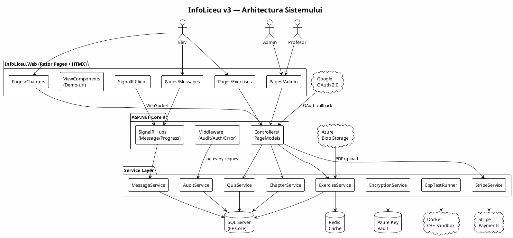
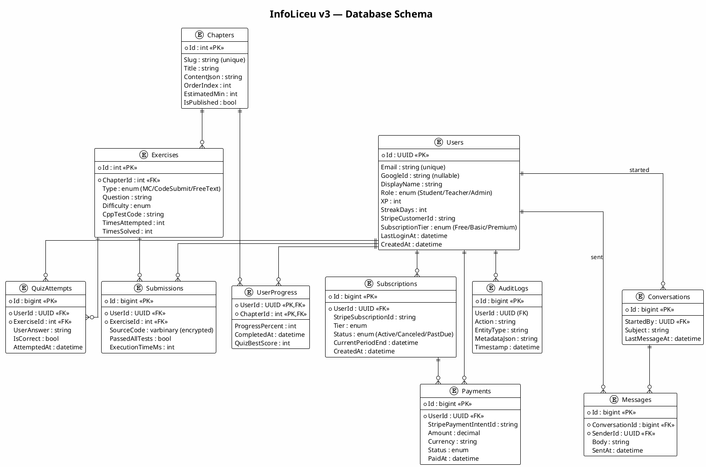
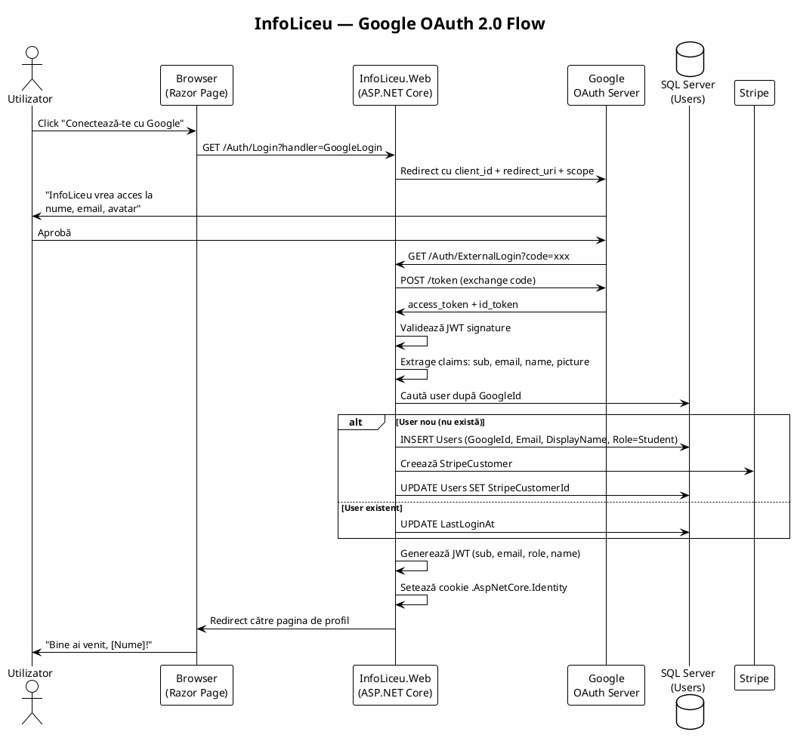
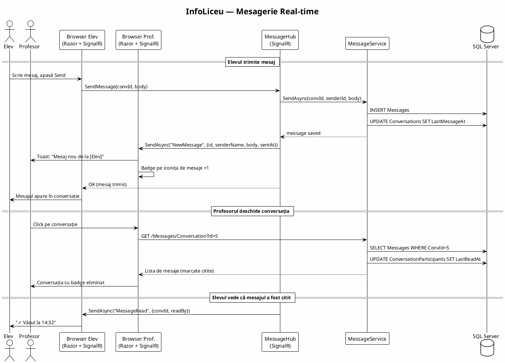
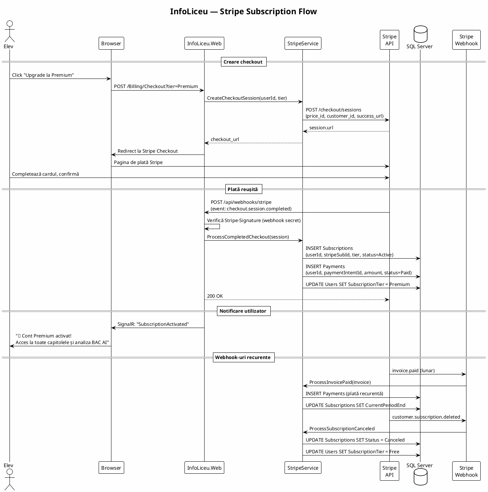
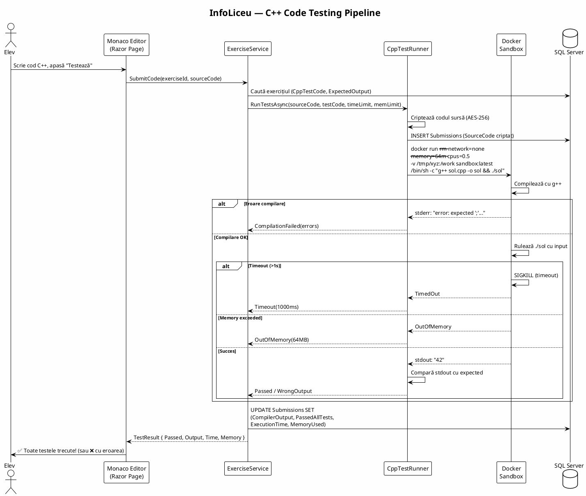

# Arhitectură .NET — InfoLiceu v3 (Razor Pages)

> **📁 Documentația a fost împărțită în fișiere separate pentru ușurința implementării pas cu pas.**
> Vezi **[docs/README.md](./docs/README.md)** pentru index și ordinea recomandată.
>
> Acest fișier rămâne ca referință completă (monolith). Folosește fișierele din `docs/` ca prompt-uri de implementare.

## De ce NU CQRS?

**CQRS** (Command Query Responsibility Segregation) separă operațiile de citire de cele de scriere — folosești modele diferite pentru `GET /chapters` vs `POST /exercises/submit`. E util când:

- Ai milioane de citiri și puține scrieri (ex: Twitter timeline)
- Modelul de citire e radical diferit de cel de scriere (ex: search engine)
- Ai event sourcing (fiecare modificare e un eveniment imutabil)
- Lucrezi cu microservicii și ai nevoie de proiecții separate

**Pentru InfoLiceu, CQRS e overkill.** Avem operații CRUD simple (capitole, exerciții, quiz-uri). CQRS ar adăuga:
- 2-3× clase pentru fiecare operație (Command + Handler + Query + Handler + Validator)
- MediatR dependency + pipeline behaviors
- Complexitate de debugging („unde se procesează SubmitAnswer?")
- Zero beneficii reale la scara acestui proiect

**Alternativa**: servicii simple cu metode async directe. Un PageModel cheamă un serviciu, serviciul lucrează cu EF Core. Clar, ușor de testat, ușor de înțeles.

---

## 1. Tech Stack

| Strat | Tehnologie | Justificare |
|-------|-----------|-------------|
| **Frontend** | ASP.NET Core Razor Pages + HTMX + Tailwind CSS v4 | Server-side rendering (ca Astro), fără SPA heavy. HTMX pentru interactivitate fără JS masiv |
| **Backend** | ASP.NET Core 9 (același proiect cu frontend-ul) | Un singur proiect = simplu de deploy și dezvoltat |
| **ORM** | Entity Framework Core 9 + SQL Server | Migrații, LINQ, change tracking |
| **Auth** | ASP.NET Core Identity + Google OAuth 2.0 | Standard Microsoft, pagini de login/register integrate |
| **Real-time** | SignalR | 🆕 Mesaje profesor-elev, notificări progres, quiz-uri live |
| **Cache** | Redis + IMemoryCache (2 nivele) | Cele mai accesate capitole și exerciții stau în cache |
| **File Storage** | Azure Blob Storage | PDF-uri BAC, avatar-uri |
| **Background Jobs** | Hangfire | Procesare subiecte, email-uri, cleanup |
| **Testing** | xUnit + Moq + Playwright (E2E) | Unit + integration + E2E |
| **CI/CD** | GitHub Actions → Azure App Service | Deploy automat |

---

## 2. Structura Proiectului

```
InfoLiceu/
├── InfoLiceu.Web/                  # Proiect unic: Razor Pages + API + EF Core
│   ├── Pages/                      # Razor Pages (server-side rendering)
│   │   ├── Index.cshtml            # Landing page
│   │   ├── Chapters/
│   │   │   └── Detail.cshtml       # /Chapters/{slug} — o pagină per capitol
│   │   ├── Exercises/
│   │   │   ├── Index.cshtml        # Listă exerciții cu filtre
│   │   │   └── Solve.cshtml        # Rezolvă un exercițiu cu Monaco Editor
│   │   ├── Bac/
│   │   │   └── Analysis.cshtml     # Analiză BAC
│   │   ├── Auth/
│   │   │   ├── Login.cshtml
│   │   │   ├── Register.cshtml
│   │   │   └── ExternalLogin.cshtml
│   │   ├── Profile/
│   │   │   └── Index.cshtml
│   │   ├── Messages/               # 🆕 Mesagerie
│   │   │   ├── Inbox.cshtml
│   │   │   └── Conversation.cshtml
│   │   ├── Admin/
│   │   │   ├── Dashboard.cshtml
│   │   │   ├── Users.cshtml
│   │   │   └── AuditLog.cshtml
│   │   └── Teacher/
│   │       ├── Students.cshtml
│   │       └── Reports.cshtml
│   │
│   ├── Services/                   # Logică de business — simplu, fără CQRS
│   │   ├── ChapterService.cs       # GetBySlug, ListChapters, UpdateProgress
│   │   ├── ExerciseService.cs      # GetById, ListByChapter, SubmitAnswer, RunCppTests
│   │   ├── QuizService.cs          # StartQuiz, SubmitAnswer, GetResults
│   │   ├── UserService.cs          # Register, Login, UpdateProfile
│   │   ├── AuditService.cs         # LogAction, QueryLogs
│   │   ├── MessageService.cs       # 🆕 SendMessage, GetConversation, MarkRead
│   │   ├── EncryptionService.cs    # Encrypt, Decrypt (AES-256-GCM)
│   │   └── CppTestRunner.cs        # Compilează și rulează C++ în Docker sandbox
│   │
│   ├── Data/
│   │   ├── AppDbContext.cs
│   │   ├── Configurations/         # Fluent API per entitate
│   │   └── Migrations/
│   │
│   ├── Hubs/
│   │   ├── MessageHub.cs           # 🆕 SignalR pentru mesaje real-time
│   │   └── ProgressHub.cs          # Notificări progres live
│   │
│   ├── ViewComponents/             # Demo-uri interactive (server-side components)
│   │   ├── BubbleSortDemo.cs
│   │   ├── FibonacciDPDemo.cs
│   │   ├── NQueensDemo.cs
│   │   ├── GraphBuilder.cs
│   │   ├── MemoryPointerDemo.cs
│   │   ├── FileIODemo.cs
│   │   └── StructSorter.cs
│   │
│   └── wwwroot/
│       ├── css/
│       ├── js/                     # HTMX + Chart.js + Monaco Editor + SignalR client
│       └── lib/                    # Biblioteci statice
│
└── tests/
    ├── InfoLiceu.UnitTests/
    │   ├── Services/
    │   │   ├── ExerciseServiceTests.cs
    │   │   ├── CppTestRunnerTests.cs
    │   │   ├── EncryptionServiceTests.cs
    │   │   └── MessageServiceTests.cs
    │   └── PageModels/
    │       └── SolvePageModelTests.cs
    └── InfoLiceu.E2ETests/
        ├── login.spec.ts
        ├── chapter-flow.spec.ts
        └── messaging.spec.ts
```

---

## 3. Database Schema (SQL Server)

```sql
-- ═══ Users & Auth ═══
CREATE TABLE Users (
    Id              UNIQUEIDENTIFIER PRIMARY KEY DEFAULT NEWID(),
    Email           NVARCHAR(256) NOT NULL,
    NormalizedEmail NVARCHAR(256) NOT NULL,
    GoogleId        NVARCHAR(128) NULL,
    DisplayName     NVARCHAR(100) NOT NULL,
    AvatarUrl       NVARCHAR(512) NULL,
    Role            TINYINT NOT NULL DEFAULT 1,  -- 1=Student, 2=Teacher, 3=Admin
    XP              INT NOT NULL DEFAULT 0,
    StreakDays      INT NOT NULL DEFAULT 0,
    LastLoginAt     DATETIME2 NULL,
    CreatedAt       DATETIME2 NOT NULL DEFAULT SYSUTCDATETIME(),
    IsActive        BIT NOT NULL DEFAULT 1
);
CREATE UNIQUE INDEX IX_Users_Email ON Users(NormalizedEmail);
CREATE UNIQUE INDEX IX_Users_GoogleId ON Users(GoogleId) WHERE GoogleId IS NOT NULL;

-- ═══ Chapters ═══
CREATE TABLE Chapters (
    Id              INT PRIMARY KEY IDENTITY,
    Slug            NVARCHAR(100) NOT NULL UNIQUE,
    Title           NVARCHAR(200) NOT NULL,
    Subtitle        NVARCHAR(500) NULL,
    Icon            NVARCHAR(10) NULL,
    OrderIndex      INT NOT NULL,
    ContentJson     NVARCHAR(MAX) NOT NULL,      -- JSON cu slides
    Tags            NVARCHAR(500) NULL,
    EstimatedMin    INT NOT NULL DEFAULT 30,
    IsPublished     BIT NOT NULL DEFAULT 1
);

-- ═══ Exercises ═══
CREATE TABLE Exercises (
    Id              INT PRIMARY KEY IDENTITY,
    ChapterId       INT NOT NULL REFERENCES Chapters(Id),
    Type            TINYINT NOT NULL,            -- 1=MultipleChoice, 2=CodeSubmit, 3=FreeText
    Question        NVARCHAR(MAX) NOT NULL,
    OptionsJson     NVARCHAR(MAX) NULL,
    CorrectAnswer   NVARCHAR(500) NOT NULL,
    Explanation     NVARCHAR(MAX) NULL,
    Difficulty      TINYINT NOT NULL DEFAULT 1,
    CppTestCode     NVARCHAR(MAX) NULL,
    ExpectedOutput  NVARCHAR(MAX) NULL,
    TimeLimitMs     INT NOT NULL DEFAULT 1000,
    MemoryLimitKb   INT NOT NULL DEFAULT 65536,
    TimesAttempted  INT NOT NULL DEFAULT 0,      -- 🚀 denormalizat pt performanță
    TimesSolved     INT NOT NULL DEFAULT 0,
    CreatedAt       DATETIME2 NOT NULL DEFAULT SYSUTCDATETIME(),
    IsPublished     BIT NOT NULL DEFAULT 1
);

-- ═══ User Progress ═══
CREATE TABLE UserProgress (
    UserId          UNIQUEIDENTIFIER NOT NULL REFERENCES Users(Id),
    ChapterId       INT NOT NULL REFERENCES Chapters(Id),
    ProgressPercent TINYINT NOT NULL DEFAULT 0,
    CompletedAt     DATETIME2 NULL,
    QuizBestScore   INT NULL,
    TimeSpentMin    INT NOT NULL DEFAULT 0,
    LastVisitedAt   DATETIME2 NOT NULL DEFAULT SYSUTCDATETIME(),
    CONSTRAINT PK_UserProgress PRIMARY KEY (UserId, ChapterId)
);

-- ═══ Quiz Attempts ═══
CREATE TABLE QuizAttempts (
    Id              BIGINT PRIMARY KEY IDENTITY,
    UserId          UNIQUEIDENTIFIER NOT NULL REFERENCES Users(Id),
    ExerciseId      INT NOT NULL REFERENCES Exercises(Id),
    UserAnswer      NVARCHAR(MAX) NOT NULL,
    IsCorrect       BIT NOT NULL,
    AttemptedAt     DATETIME2 NOT NULL DEFAULT SYSUTCDATETIME()
);

-- ═══ Code Submissions ═══
CREATE TABLE Submissions (
    Id              BIGINT PRIMARY KEY IDENTITY,
    UserId          UNIQUEIDENTIFIER NOT NULL REFERENCES Users(Id),
    ExerciseId      INT NOT NULL REFERENCES Exercises(Id),
    SourceCode      VARBINARY(MAX) NOT NULL,     -- 🔒 ENCRYPTED cu AES-256
    CompilerOutput  NVARCHAR(MAX) NULL,
    TestResultsJson NVARCHAR(MAX) NULL,
    PassedAllTests  BIT NOT NULL,
    ExecutionTimeMs INT NULL,
    MemoryUsedKb    INT NULL,
    SubmittedAt     DATETIME2 NOT NULL DEFAULT SYSUTCDATETIME()
);

-- ═══ Audit Trail ═══
CREATE TABLE AuditLogs (
    Id              BIGINT PRIMARY KEY IDENTITY,
    UserId          UNIQUEIDENTIFIER NULL REFERENCES Users(Id),
    Action          NVARCHAR(50) NOT NULL,        -- 'Login','ViewChapter','SubmitAnswer','SendMessage'
    EntityType      NVARCHAR(100) NULL,
    EntityId        NVARCHAR(100) NULL,
    MetadataJson    NVARCHAR(MAX) NULL,           -- IP, UserAgent, detalii
    Timestamp       DATETIME2 NOT NULL DEFAULT SYSUTCDATETIME()
);

-- ═══ 🆕 Mesagerie ═══
CREATE TABLE Conversations (
    Id              BIGINT PRIMARY KEY IDENTITY,
    Subject         NVARCHAR(200) NULL,
    StartedBy       UNIQUEIDENTIFIER NOT NULL REFERENCES Users(Id),
    StartedAt       DATETIME2 NOT NULL DEFAULT SYSUTCDATETIME(),
    LastMessageAt   DATETIME2 NOT NULL DEFAULT SYSUTCDATETIME()
);

CREATE TABLE ConversationParticipants (
    ConversationId  BIGINT NOT NULL REFERENCES Conversations(Id) ON DELETE CASCADE,
    UserId          UNIQUEIDENTIFIER NOT NULL REFERENCES Users(Id),
    LastReadAt      DATETIME2 NOT NULL DEFAULT SYSUTCDATETIME(),
    IsArchived      BIT NOT NULL DEFAULT 0,
    CONSTRAINT PK_ConvParticipants PRIMARY KEY (ConversationId, UserId)
);

CREATE TABLE Messages (
    Id              BIGINT PRIMARY KEY IDENTITY,
    ConversationId  BIGINT NOT NULL REFERENCES Conversations(Id) ON DELETE CASCADE,
    SenderId        UNIQUEIDENTIFIER NOT NULL REFERENCES Users(Id),
    Body            NVARCHAR(4000) NOT NULL,
    SentAt          DATETIME2 NOT NULL DEFAULT SYSUTCDATETIME(),
    IsEdited        BIT NOT NULL DEFAULT 0,
    EditedAt        DATETIME2 NULL
);

-- ═══ 📊 PERFORMANȚĂ: Indecși ═══
-- Cele mai frecvente interogări primesc indecși dedicați
CREATE INDEX IX_AuditLogs_Timestamp ON AuditLogs(Timestamp DESC);
CREATE INDEX IX_AuditLogs_UserId_Action ON AuditLogs(UserId, Action);

CREATE INDEX IX_QuizAttempts_UserId_ExerciseId ON QuizAttempts(UserId, ExerciseId)
    INCLUDE (IsCorrect, AttemptedAt);

CREATE INDEX IX_UserProgress_UserId ON UserProgress(UserId)
    INCLUDE (ChapterId, ProgressPercent, CompletedAt);
CREATE INDEX IX_UserProgress_ChapterId ON UserProgress(ChapterId, ProgressPercent DESC);

CREATE INDEX IX_Messages_ConversationId ON Messages(ConversationId, SentAt DESC);

CREATE INDEX IX_ConversationParticipants_UserId ON ConversationParticipants(UserId, LastReadAt DESC)
    INCLUDE (ConversationId, IsArchived);

CREATE INDEX IX_Exercises_ChapterId_Difficulty ON Exercises(ChapterId, Difficulty)
    INCLUDE (Type, Question, TimesAttempted);

CREATE INDEX IX_Submissions_UserId_ExerciseId ON Submissions(UserId, ExerciseId)
    INCLUDE (PassedAllTests, SubmittedAt);
```

---

## 4. 🚀 Performanță Bază de Date

### 4.1. EF Core — Connection Pooling + Split Queries

```csharp
builder.Services.AddDbContextPool<AppDbContext>(options =>
{
    options.UseSqlServer(connStr, sql =>
    {
        sql.EnableRetryOnFailure(3);
        sql.CommandTimeout(30);
        sql.UseQuerySplittingBehavior(QuerySplittingBehavior.SplitQuery); // evită Cartesian explosion
    });
}, poolSize: 128);
```

### 4.2. Query-uri eficiente (Proiecție + AsNoTracking)

```csharp
// ❌ RĂU: Toate coloanele, tracking activ
var chapters = await _db.Chapters.ToListAsync();

// ✅ BUN: Proiecție — doar coloanele necesare, zero tracking
var cards = await _db.Chapters
    .Where(c => c.IsPublished)
    .OrderBy(c => c.OrderIndex)
    .Select(c => new ChapterCardDto {
        Slug = c.Slug, Title = c.Title, Icon = c.Icon, Time = c.EstimatedMin
    })
    .AsNoTracking()
    .ToListAsync();

// ✅ BUN: Compiled queries — interogări pre-compilate, 0 overhead per apel
private static readonly Func<AppDbContext, int, IAsyncEnumerable<Exercise>>
    ExercisesByChapter = EF.CompileAsyncQuery(
        (AppDbContext ctx, int chId) =>
            ctx.Exercises.Where(e => e.ChapterId == chId && e.IsPublished));

// ✅ BUN: Keyset pagination — folosește indexul, nu face OFFSET scan
public async Task<List<Exercise>> GetPage(long? afterId, int take = 20)
{
    var q = _db.Exercises.AsNoTracking().OrderBy(e => e.Id);
    if (afterId.HasValue) q = (IOrderedQueryable<Exercise>)q.Where(e => e.Id > afterId.Value);
    return await q.Take(take).ToListAsync();
}
```

### 4.3. Caching pe 2 Nivele

```csharp
// Nivel 1: IMemoryCache (in-process, ~0.01ms) — capitole
public async Task<Chapter> GetChapterBySlug(string slug)
{
    var key = $"ch:{slug}";
    if (_mem.TryGetValue(key, out Chapter ch)) return ch;
    
    ch = await _db.Chapters.AsNoTracking().FirstOrDefaultAsync(c => c.Slug == slug);
    if (ch != null) _mem.Set(key, ch, TimeSpan.FromMinutes(30));
    return ch;
}

// Nivel 2: Redis (distribuit, shared) — liste de exerciții
public async Task<List<ExerciseDto>> GetExercises(int chapterId)
{
    var key = $"ex:ch{chapterId}";
    var cached = await _redis.StringGetAsync(key);
    if (cached.HasValue) return JsonSerializer.Deserialize<List<ExerciseDto>>(cached);
    
    var list = await _db.Exercises.Where(e => e.ChapterId == chapterId)
        .Select(e => new ExerciseDto { ... }).AsNoTracking().ToListAsync();
    
    await _redis.StringSetAsync(key, JsonSerializer.Serialize(list), TimeSpan.FromHours(1));
    return list;
}
```

### 4.4. Denormalizare — contoare pre-calculate

```sql
-- În loc de COUNT(*) la fiecare afișare, actualizăm un câmp denormalizat:
ALTER TABLE Exercises ADD TimesAttempted INT NOT NULL DEFAULT 0;
ALTER TABLE Exercises ADD TimesSolved   INT NOT NULL DEFAULT 0;

-- Actualizat după fiecare submit:
UPDATE Exercises 
SET TimesAttempted += 1,
    TimesSolved   += CASE WHEN @passed = 1 THEN 1 ELSE 0 END
WHERE Id = @exerciseId;
```

---

## 5. 🆕 Mesageria (SignalR + DB)

### Flux complet:
```
Elev trimite mesaj → MessageService.Save() → INSERT Messages
→ SignalR MessageHub → notifică profesorul real-time
→ Profesorul vede badge + toast → deschide conversația → MarkRead()
```

### SignalR Hub

```csharp
public class MessageHub : Hub
{
    public override async Task OnConnectedAsync()
    {
        var userId = Context.UserIdentifier;
        await Groups.AddToGroupAsync(Context.ConnectionId, $"user_{userId}");
    }

    public async Task SendMessage(long conversationId, string body)
    {
        var senderId = Guid.Parse(Context.UserIdentifier);
        var msg = await _messageService.SendAsync(conversationId, senderId, body);
        
        var participants = await _messageService.GetParticipantIds(conversationId);
        foreach (var pid in participants.Where(p => p != senderId))
        {
            await Clients.Group($"user_{pid}").SendAsync("NewMessage", new
            {
                msg.Id, msg.ConversationId,
                SenderName = Context.User.Identity.Name,
                msg.Body, msg.SentAt
            });
        }
    }
}
```

### Frontend Razor + HTMX

```html
@* Messages/Inbox.cshtml *@
<div id="inbox" 
     hx-get="/Messages/InboxList" 
     hx-trigger="every 30s, new-message from:body">
    @foreach (var conv in Model.Conversations)
    {
        <a asp-page="Conversation" asp-route-id="@conv.Id"
           class="@(conv.HasUnread ? "font-bold" : "")">
            <span>@conv.OtherParticipant</span>
            <span class="text-muted">@conv.LastPreview</span>
            @if (conv.UnreadCount > 0) { <span class="badge">@conv.UnreadCount</span> }
        </a>
    }
</div>

<script>
const conn = new signalR.HubConnectionBuilder().withUrl("/messageHub").build();
conn.on("NewMessage", msg => {
    htmx.trigger("#inbox", "new-message");
    showToast(`Mesaj de la ${msg.senderName}`);
});
conn.start();
</script>
```

---

## 6. Autentificare Google + Roluri

```csharp
// Program.cs
builder.Services.AddAuthentication()
    .AddGoogle(o => {
        o.ClientId = config["Google:ClientId"];
        o.ClientSecret = config["Google:ClientSecret"];
        o.SignInScheme = IdentityConstants.ExternalScheme;
    });

builder.Services.AddAuthorization(o => {
    o.AddPolicy("Teacher", p => p.RequireRole("Teacher", "Admin"));
    o.AddPolicy("Admin",   p => p.RequireRole("Admin"));
});
```

```csharp
// Autorizare per pagină — simplu, declarativ
[Authorize]                          public class ProfileModel : PageModel { }
[Authorize(Roles = "Teacher,Admin")] public class StudentsModel : PageModel { }
[Authorize(Roles = "Admin")]         public class AuditLogModel : PageModel { }
```

---

## 7. Criptare (AES-256-GCM)

```csharp
public class EncryptionService
{
    private readonly byte[] _key; // 32 bytes din Key Vault, rotate la 90 zile

    public byte[] Encrypt(string plaintext)
    {
        byte[] nonce = RandomNumberGenerator.GetBytes(12);
        byte[] plainBytes = Encoding.UTF8.GetBytes(plaintext);
        byte[] cipherBytes = new byte[plainBytes.Length];
        byte[] tag = new byte[16];
        using var aes = new AesGcm(_key);
        aes.Encrypt(nonce, plainBytes, cipherBytes, tag);
        // Returnează: nonce(12) + ciphertext + tag(16)
        var result = new byte[nonce.Length + cipherBytes.Length + tag.Length];
        Buffer.BlockCopy(nonce, 0, result, 0, nonce.Length);
        Buffer.BlockCopy(cipherBytes, 0, result, nonce.Length, cipherBytes.Length);
        Buffer.BlockCopy(tag, 0, result, nonce.Length + cipherBytes.Length, tag.Length);
        return result;
    }
}

// Ce criptăm:
// - Submissions.SourceCode (codul C++ al elevului)
// - Messages.Body (opțional, doar conversații private)
```

---

## 8. Unit Testing C++ (Docker Sandbox)

```csharp
public async Task<TestResult> RunTests(string source, string input, 
    string expected, int timeMs, int memKb)
{
    var dir = Path.Combine(Path.GetTempPath(), Guid.NewGuid().ToString());
    Directory.CreateDirectory(dir);
    try {
        await File.WriteAllTextAsync(Path.Combine(dir, "sol.cpp"), source);
        
        var compile = await DockerRun("g++ -std=c++17 -O2 sol.cpp -o sol", dir);
        if (!compile.Ok) return TestResult.CompileError(compile.Stderr);
        
        var run = await DockerRun("./sol", dir, timeMs, memKb, input);
        if (run.TimedOut) return TestResult.Timeout();
        if (run.OOM)      return TestResult.OutOfMemory();
        
        return run.Stdout.Trim() == expected.Trim()
            ? TestResult.Passed(run.TimeMs, run.MemKb)
            : TestResult.Wrong(run.Stdout, expected);
    }
    finally { if (Directory.Exists(dir)) Directory.Delete(dir, true); }
}
```

---

## 9. Demo-uri Interactive (View Components + HTMX)

Fiecare demo JS actual devine un **View Component** server-side + HTMX:

```csharp
// FibonacciDPDemo.cs
public class FibonacciDPDemo : ViewComponent
{
    public IViewComponentResult Invoke(int n = 5)
        => View(new FibModel { N = n, Rows = CalcTable(n) });
}
```

```html
@* Default.cshtml *@
<input type="number" name="n" value="@Model.N" min="1" max="25"
       hx-get="/Demo/FibStep" hx-target="#fib-table" hx-trigger="change">

<div id="fib-table" hx-get="/Demo/FibStep" hx-trigger="load" hx-include="[name=n]">
    @foreach (var row in Model.Rows) { <div class="cell">@row</div> }
</div>
```

---

## 10. Plan de Migrare

| Faza | Durată | Conținut |
|------|--------|----------|
| 1. Fundație | 1.5 săpt. | Proiect Razor Pages, EF Core + DB, Identity + Google Auth |
| 2. Servicii | 2 săpt. | Chapter, Exercise, Quiz, Audit, Encryption services |
| 3. 🆕 Mesagerie | 1 săpt. | MessageService, SignalR Hub, Inbox/Conversation pages |
| 4. UI Capitole | 2.5 săpt. | 13 capitole Razor + 17 View Components (demo-uri) |
| 5. Quiz + C++ | 1.5 săpt. | Quiz player, Monaco Editor, CppTestRunner Docker |
| 6. Admin/Teacher | 1 săpt. | Dashboard-uri, gestiune utilizatori, rapoarte progres |
| 7. Testing | 1.5 săpt. | xUnit + Playwright E2E |
| 8. Deploy + Perf | 0.5 săpt. | CI/CD, Redis cache, load testing, query tuning |
| **TOTAL** | **~11.5 săpt.** | |

---

## 11. Comparație: cu CQRS vs fără

| | Cu CQRS (MediatR) | Fără CQRS (direct) |
|---|---|---|
| **Fișiere per operație** | ~3 (Command+Handler+Validator) | 1 metodă |
| **Timp învățare** | ~2 săptămâni | 0 — C# standard |
| **Debugging** | Pipeline → Handler (indirect) | Direct în metodă |
| **Testare** | Testezi handler izolat | Testezi serviciul direct |
| **Overhead** | Reflection + DI resolution | Zero |
| **Când are sens** | Event sourcing, microservicii | CRUD, aplicații standard |

**Pentru InfoLiceu: fără CQRS e decizia corectă.**

---

## 12. 🎨 Diagrame PlantUML

### 12.1. Arhitectura Generală a Sistemului



### 12.2. Database ERD (Entity-Relationship Diagram)



### 12.3. Flow Autentificare (Google OAuth)



### 12.4. Flow Mesagerie (SignalR)



### 12.5. Flow Plată Stripe (Subscription)



### 12.6. Flow Execuție C++ (Docker Sandbox)



---

## 13. 🔄 Strategia de Migrare din Astro

### 13.1. Ce păstrăm, ce rescriem

| Resursă Astro | Destinație .NET | Strategie |
|---|---|---|
| `src/pages/capitole/*.astro` | `Pages/Chapters/Detail.cshtml` | Rescriere HTML → Razor, structură slide-urilor păstrată |
| `public/js/animations.js` | `ViewComponents/` + HTMX | Fiecare `init*Demo()` devine View Component |
| `src/components/Quiz.tsx` | `ViewComponents/Quiz.cs` | Preact → Razor + HTMX |
| `public/js/charts.js` | Chart.js rămâne (JS interop) | Se păstrează ca bibliotecă statică |
| `src/styles/global.css` | `wwwroot/css/site.css` | Migrare 1:1, Tailwind v4 păstrat |
| `public/data/*.json` | EF Core Seed Data | JSON-urile devin migrații EF Core |
| `src/components/Header.astro` | `Pages/Shared/_Layout.cshtml` | Componentă Razor + ViewComponent |
| `src/components/Sidebar.astro` | `Pages/Shared/_Sidebar.cshtml` | Partial View |
| `public/sw.js` | Service Worker păstrat ca static | Copiat în `wwwroot/` |

### 13.2. Plan de migrare pas cu pas

```
Faza 0: Setup (2 zile)
├── creează proiect ASP.NET Core Razor Pages
├── configurează EF Core + SQL Server
├── migrează global.css → wwwroot/css/
├── configurează Tailwind v4 prin Vite sau CDN
└── configurează Identity + Google Auth

Faza 1: Shell + Navigare (3 zile)
├── _Layout.cshtml (Header + Sidebar + Footer)
├── ChapterLayout.cshtml (hero, nav-bar, wrapper)
├── Theme toggle (dark/light)
├── Search modal
└── Responsive design (mobile first)

Faza 2: Capitole — conversie conținut (2 săptămâni)
├── Script: parsează fiecare .astro → extrage slide-uri → JSON
├── Creează ChapterService + seed data din JSON
├── Chapter/Detail.cshtml: render-ează slide-uri din JSON
├── Migrează componentele de teorie:
│   ├── TheorySlide → ViewComponent
│   ├── Callout → ViewComponent
│   ├── ComplexityTable → ViewComponent
│   └── CodeBlock (cu syntax highlighting) → TagHelper
└── Testează fiecare capitol (13 capitole)

Faza 3: Demo-uri interactive (2 săptămâni)
├── Bubble Sort → ViewComponent + HTMX
├── N-Queens → ViewComponent + HTMX
├── Fibonacci DP → ViewComponent + HTMX
├── Pointer Memory → ViewComponent + HTMX
├── File I/O → ViewComponent + HTMX
├── Struct Sorter → ViewComponent + HTMX
├── Graph Builder → ViewComponent + Canvas JS interop
├── Restul demo-urilor matrici, căutări, etc.
└── Unifică speed control + status display

Faza 4: Quiz + Exerciții (1.5 săptămâni)
├── ExerciseService + seed data
├── Quiz player ViewComponent
├── Monaco Editor integrare (JS interop)
├── CppTestRunner + Docker sandbox
└── Submissions history page

Faza 5: Auth + Profil + Mesagerie (1 săptămână)
├── Login/Register cu Google
├── Profil utilizator (XP, streak, progres)
├── MessageService + SignalR Hub
├── Inbox + Conversation pages
└── Notification system (toast + badge)

Faza 6: Stripe + Monetizare (1 săptămână)
├── StripeService (checkout, webhooks)
├── Billing pages (pricing, checkout)
├── Subscription management
├── Feature gating per tier (Premium = BAC AI, toate capitolele)
└── Webhook handler + retry logic

Faza 7: Admin + Profesor (1 săptămână)
├── Admin dashboard (user management)
├── Audit log viewer
├── Teacher dashboard (student progress)
├── Exercise creator/editor
└── Reports (export CSV/PDF)

Faza 8: Testing + Deploy (1.5 săptămâni)
├── xUnit unit tests (services)
├── xUnit integration tests (API)
├── Playwright E2E tests
├── CI/CD pipeline (GitHub Actions)
├── Azure deploy (App Service + SQL + Redis)
└── Load testing + performance tuning
```

### 13.3. Script de conversie Astro → JSON Seed Data

```csharp
// Tools/AstroChapterParser.cs — rulează o singură dată
public class AstroChapterParser
{
    public static ChapterSeedData ParseChapter(string astroFilePath)
    {
        var html = File.ReadAllText(astroFilePath);
        var doc = new HtmlDocument();
        doc.LoadHtml(html);

        var sections = new List<SlideData>();
        foreach (var section in doc.DocumentNode.SelectNodes("//section"))
        {
            var slide = section.SelectSingleNode(".//div[contains(@class,'slide')]");
            if (slide == null) continue;

            sections.Add(new SlideData
            {
                SectionId = section.GetAttributeValue("id", ""),
                Title = slide.SelectSingleNode(".//h2")?.InnerText ?? "",
                Icon = slide.SelectSingleNode(".//span[contains(@class,'slide-icon')]")?.InnerText ?? "",
                HtmlContent = slide.SelectSingleNode(".//div[contains(@class,'slide-body')]")?.InnerHtml ?? ""
            });
        }

        return new ChapterSeedData
        {
            Slug = Path.GetFileNameWithoutExtension(astroFilePath),
            Title = ExtractTitle(html),
            Subtitle = ExtractSubtitle(html),
            Icon = ExtractIcon(html),
            Slides = sections,
            Tags = ExtractTags(html)
        };
    }
}
```

---

## 14. 💳 Integrare Stripe

### 14.1. Model de business (tiers)

| Feature | Free | Basic (29 RON/lună) | Premium (59 RON/lună) |
|---|---|---|---|
| Capitole | ✅ 3 capitole | ✅ Toate (13) | ✅ Toate (13) |
| Exerciții | ✅ 50/lună | ✅ Nelimitat | ✅ Nelimitat |
| Demo-uri | ✅ | ✅ | ✅ |
| Quiz-uri | ✅ | ✅ | ✅ |
| Mesagerie profesori | ❌ | ✅ | ✅ |
| Analiză BAC AI | ❌ | ❌ | ✅ |
| C++ Code Runner | ❌ | ✅ 10/zi | ✅ Nelimitat |
| Suport prioritar | ❌ | ❌ | ✅ |

### 14.2. Stripe Service

```csharp
public class StripeService
{
    private readonly StripeClient _stripe;
    private readonly AppDbContext _db;
    private readonly IConfiguration _config;

    // Prețuri definite în Stripe Dashboard → mapează aici
    private readonly Dictionary<SubscriptionTier, string> _priceIds = new()
    {
        [SubscriptionTier.Basic]   = "price_basic_monthly_ron",
        [SubscriptionTier.Premium] = "price_premium_monthly_ron"
    };

    public async Task<string> CreateCheckoutSession(Guid userId, SubscriptionTier tier)
    {
        var user = await _db.Users.FindAsync(userId);
        var options = new SessionCreateOptions
        {
            Customer = user.StripeCustomerId,
            Mode = "subscription",
            LineItems = new[] {
                new SessionLineItemOptions {
                    Price = _priceIds[tier],
                    Quantity = 1
                }
            },
            SuccessUrl = $"{_config["BaseUrl"]}/Billing/Success?session_id={{CHECKOUT_SESSION_ID}}",
            CancelUrl = $"{_config["BaseUrl"]}/Billing/Cancel",
            Metadata = new Dictionary<string, string> {
                ["UserId"] = userId.ToString(),
                ["Tier"] = tier.ToString()
            }
        };

        var session = await _stripe.Checkout.Sessions.CreateAsync(options);
        return session.Url;
    }

    public async Task ProcessWebhook(string json, string stripeSignature)
    {
        var stripeEvent = EventUtility.ConstructEvent(
            json, stripeSignature, _config["Stripe:WebhookSecret"]);

        switch (stripeEvent.Type)
        {
            case "checkout.session.completed":
                await HandleCheckoutCompleted(stripeEvent);
                break;
            case "invoice.paid":
                await HandleInvoicePaid(stripeEvent);
                break;
            case "customer.subscription.deleted":
                await HandleSubscriptionCanceled(stripeEvent);
                break;
        }
    }

    private async Task HandleCheckoutCompleted(Event stripeEvent)
    {
        var session = stripeEvent.Data.Object as Session;
        var userId = Guid.Parse(session.Metadata["UserId"]);
        var tier = Enum.Parse<SubscriptionTier>(session.Metadata["Tier"]);

        // Creează abonamentul
        var sub = new Subscription
        {
            UserId = userId,
            StripeSubscriptionId = session.SubscriptionId,
            Tier = tier,
            Status = SubscriptionStatus.Active,
            CurrentPeriodEnd = DateTime.UtcNow.AddMonths(1)
        };
        _db.Subscriptions.Add(sub);

        // Înregistrează plata
        var payment = new Payment
        {
            UserId = userId,
            StripePaymentIntentId = session.PaymentIntentId,
            Amount = session.AmountTotal / 100m,
            Currency = session.Currency,
            Status = PaymentStatus.Paid,
            PaidAt = DateTime.UtcNow
        };
        _db.Payments.Add(payment);

        // Upgrade user
        var user = await _db.Users.FindAsync(userId);
        user.SubscriptionTier = tier;

        await _db.SaveChangesAsync();
    }
}
```

### 14.3. Stripe Webhook Controller

```csharp
[Route("api/webhooks/stripe")]
[ApiController]
public class StripeWebhookController : ControllerBase
{
    [HttpPost]
    public async Task<IActionResult> Index()
    {
        var json = await new StreamReader(HttpContext.Request.Body).ReadToEndAsync();
        var signature = Request.Headers["Stripe-Signature"];

        try
        {
            await _stripeService.ProcessWebhook(json, signature);
            return Ok();
        }
        catch (StripeException ex)
        {
            _logger.LogError(ex, "Stripe webhook failed");
            return BadRequest(new { error = ex.Message });
        }
    }
}
```

### 14.4. Feature Gating (acces per abonament)

```csharp
// Atribut custom pentru a restricționa accesul la capitole
public class RequireSubscriptionAttribute : Attribute
{
    public SubscriptionTier MinimumTier { get; }
    public RequireSubscriptionAttribute(SubscriptionTier tier) => MinimumTier = tier;
}

// Middleware / Filter
public class SubscriptionFilter : IAsyncPageFilter
{
    public async Task OnPageHandlerExecutionAsync(
        PageHandlerExecutingContext context, PageHandlerExecutionDelegate next)
    {
        var user = await _userManager.GetUserAsync(context.HttpContext.User);
        var requiredTier = context.HandlerInstance?.GetType()
            .GetCustomAttribute<RequireSubscriptionAttribute>()?.MinimumTier 
            ?? SubscriptionTier.Free;

        if (user.SubscriptionTier < requiredTier)
        {
            context.Result = new RedirectToPageResult("/Billing/Upgrade", new { 
                required = requiredTier, current = user.SubscriptionTier 
            });
            return;
        }

        await next();
    }
}

// Utilizare: restricționează paginile premium
[RequireSubscription(SubscriptionTier.Premium)]
public class BacAnalysisModel : PageModel { }  // Analiza BAC AI — doar Premium

[RequireSubscription(SubscriptionTier.Basic)]
public class CppRunnerModel : PageModel { }     // C++ runner — Basic+
```

---

## 15. 🏗️ EF Core Best Practices

### 15.1. Configurare entități (Fluent API)

```csharp
// ❌ RĂU: Data annotations în entități (poluează domain model)
public class User {
    [Key]
    [DatabaseGenerated(DatabaseGeneratedOption.Identity)]
    public Guid Id { get; set; }
}

// ✅ BUN: Fluent API în fișiere separate de configurare
public class UserConfiguration : IEntityTypeConfiguration<User>
{
    public void Configure(EntityTypeBuilder<User> builder)
    {
        builder.ToTable("Users");
        builder.HasKey(u => u.Id);
        builder.Property(u => u.Id).HasDefaultValueSql("NEWID()");
        
        builder.Property(u => u.Email).IsRequired().HasMaxLength(256);
        builder.HasIndex(u => u.NormalizedEmail).IsUnique();
        
        builder.Property(u => u.DisplayName).IsRequired().HasMaxLength(100);
        builder.Property(u => u.Role).HasConversion<int>(); // enum → int
        
        // Owned entity: adresă (value object)
        builder.OwnsOne(u => u.Address, addr => {
            addr.Property(a => a.City).HasMaxLength(100);
            addr.Property(a => a.Country).HasMaxLength(50);
        });

        // Query filter: nu returna utilizatori șterși logic
        builder.HasQueryFilter(u => u.IsActive);
    }
}

// Program.cs
protected override void OnModelCreating(ModelBuilder modelBuilder)
{
    modelBuilder.ApplyConfigurationsFromAssembly(Assembly.GetExecutingAssembly());
}
```

### 15.2. Migrații inteligente

```bash
# Creează migrația
dotnet ef migrations add AddStripeSubscriptionTables

# Generează script SQL idempotent (pentru deploy manual)
dotnet ef migrations script --idempotent -o deploy/2026-06-25.sql

# În Program.cs: aplică automat migrațiile la startup (dev/staging doar!)
if (app.Environment.IsDevelopment())
{
    using var scope = app.Services.CreateScope();
    var db = scope.ServiceProvider.GetRequiredService<AppDbContext>();
    await db.Database.MigrateAsync();
}
```

### 15.3. Seed Data

```csharp
public static class DbSeeder
{
    public static async Task SeedAsync(AppDbContext db)
    {
        if (await db.Chapters.AnyAsync()) return; // deja populat

        var jsonPath = Path.Combine(AppDomain.CurrentDomain.BaseDirectory, "SeedData", "chapters.json");
        var chaptersJson = await File.ReadAllTextAsync(jsonPath);
        var chapters = JsonSerializer.Deserialize<List<Chapter>>(chaptersJson);

        db.Chapters.AddRange(chapters);
        await db.SaveChangesAsync();
    }
}

// Program.cs
if (app.Environment.IsDevelopment())
{
    using var scope = app.Services.CreateScope();
    await DbSeeder.SeedAsync(scope.ServiceProvider.GetRequiredService<AppDbContext>());
}
```

### 15.4. Interceptors (audit, soft delete)

```csharp
// Interceptor pentru audit automat
public class AuditInterceptor : SaveChangesInterceptor
{
    private readonly IHttpContextAccessor _http;

    public override async ValueTask<InterceptionResult<int>> SavingChangesAsync(
        DbContextEventData eventData, InterceptionResult<int> result, CancellationToken ct)
    {
        var db = eventData.Context as AppDbContext;
        var userId = _http.HttpContext?.User?.FindFirstValue(ClaimTypes.NameIdentifier);
        
        foreach (var entry in db.ChangeTracker.Entries()
            .Where(e => e.State is EntityState.Added or EntityState.Modified or EntityState.Deleted))
        {
            var audit = new AuditLog
            {
                UserId = userId != null ? Guid.Parse(userId) : null,
                Action = entry.State.ToString(),
                EntityType = entry.Entity.GetType().Name,
                EntityId = entry.Properties.FirstOrDefault(p => p.Metadata.IsPrimaryKey())?.CurrentValue?.ToString(),
                MetadataJson = JsonSerializer.Serialize(new {
                    Ip = _http.HttpContext?.Connection.RemoteIpAddress?.ToString(),
                    entry.State,
                    Changes = entry.Properties.Where(p => p.IsModified)
                        .ToDictionary(p => p.Metadata.Name, p => new { Old = p.OriginalValue, New = p.CurrentValue })
                }),
                Timestamp = DateTime.UtcNow
            };
            db.AuditLogs.Add(audit);
        }

        return await base.SavingChangesAsync(eventData, result, ct);
    }
}
```

---

## 16. Plan de Migrare (Actualizat cu Stripe)

| Faza | Durată | Conținut |
|------|--------|----------|
| 0. Setup proiect | 2 zile | Proiect .NET 9 Razor Pages, EF Core, Tailwind, Identity |
| 1. Shell + Navigare | 3 zile | Layout, header, sidebar, theming, responsive |
| 2. Capitole (conversie conținut) | 2 săpt. | 13 capitole + componente teorie |
| 3. Demo-uri interactive | 2 săpt. | 17 ViewComponents + HTMX |
| 4. Quiz + Exerciții | 1.5 săpt. | Quiz player, Monaco Editor, C++ Docker |
| 5. Auth + Profil + Mesagerie | 1 săpt. | Google login, profil, SignalR chat |
| 6. 💳 Stripe + Monetizare | 1 săpt. | Checkout, webhooks, subscriptions, feature gating |
| 7. Admin + Profesor | 1 săpt. | Dashboard-uri, gestiune, rapoarte |
| 8. Testing + Deploy | 1.5 săpt. | Unit/E2E tests, CI/CD, Azure deploy |
| **TOTAL** | **~12 săptămâni** | |
