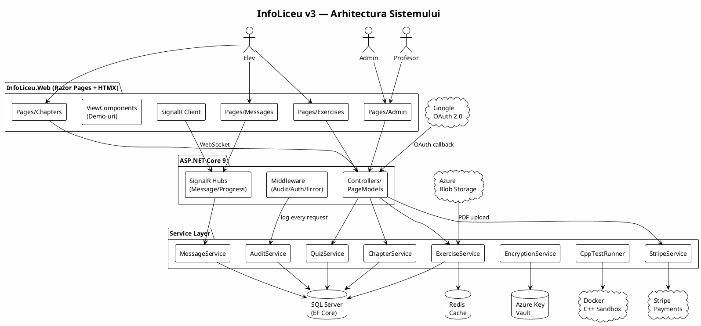
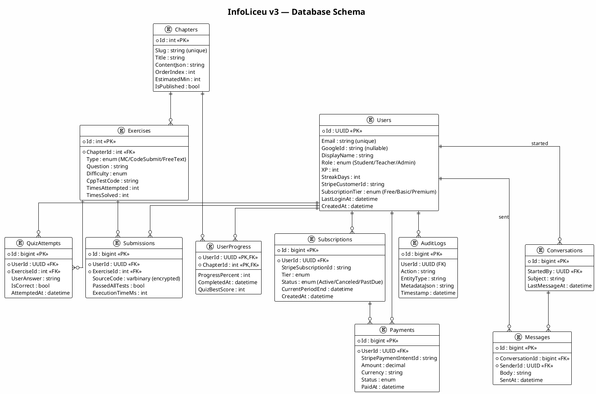
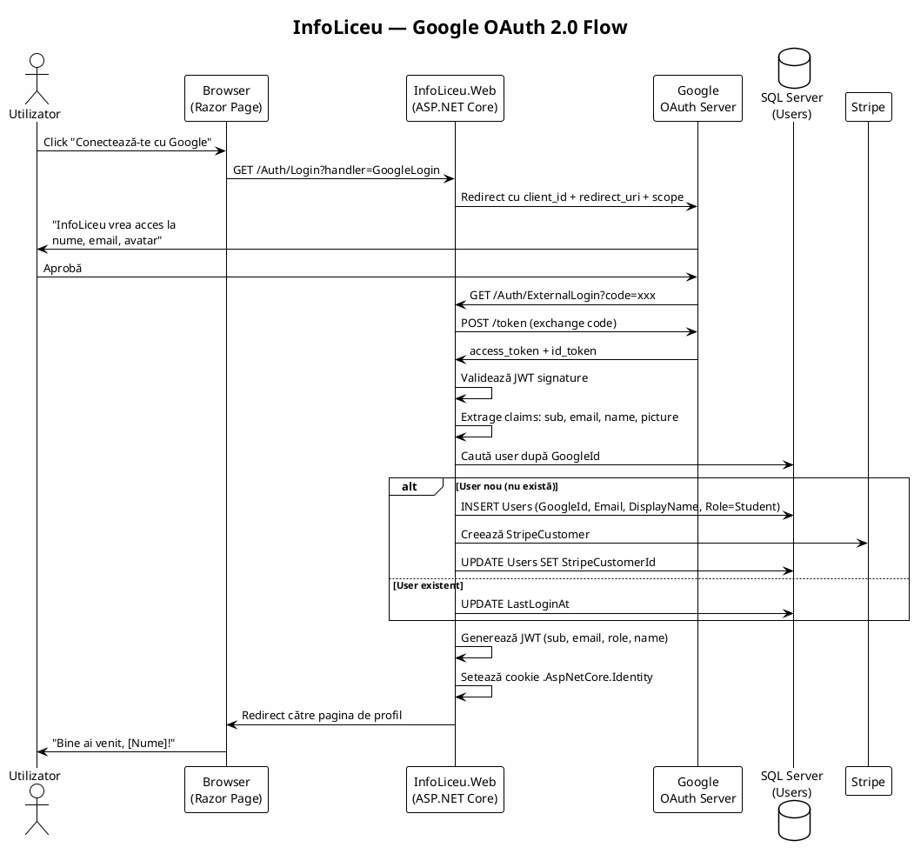
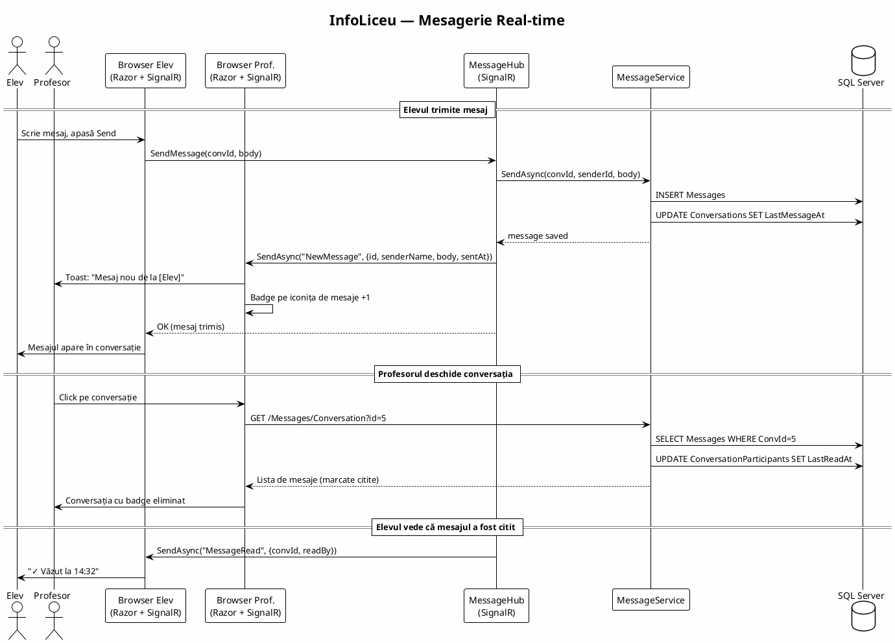
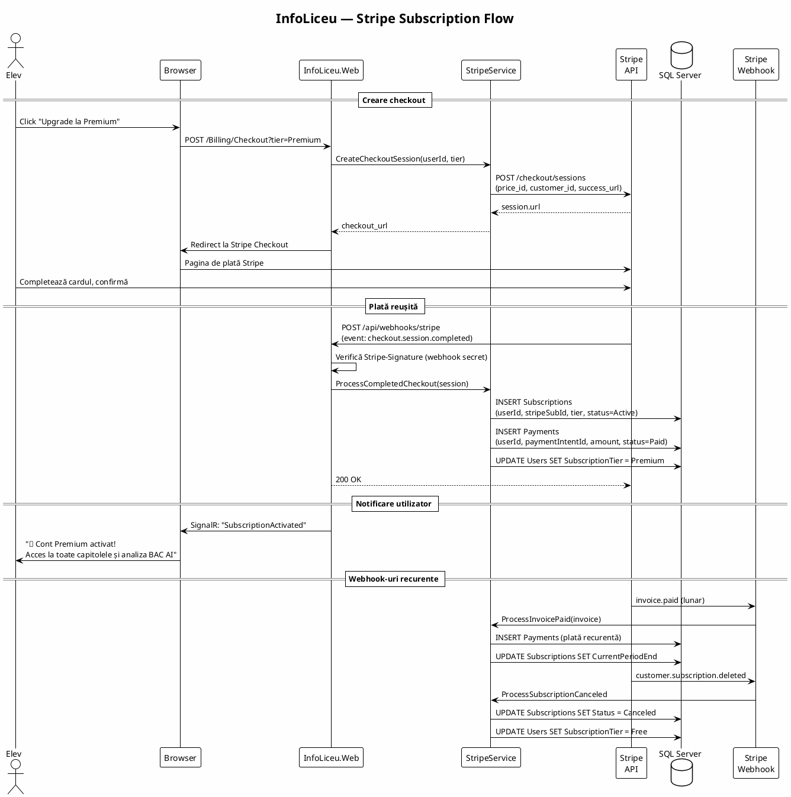
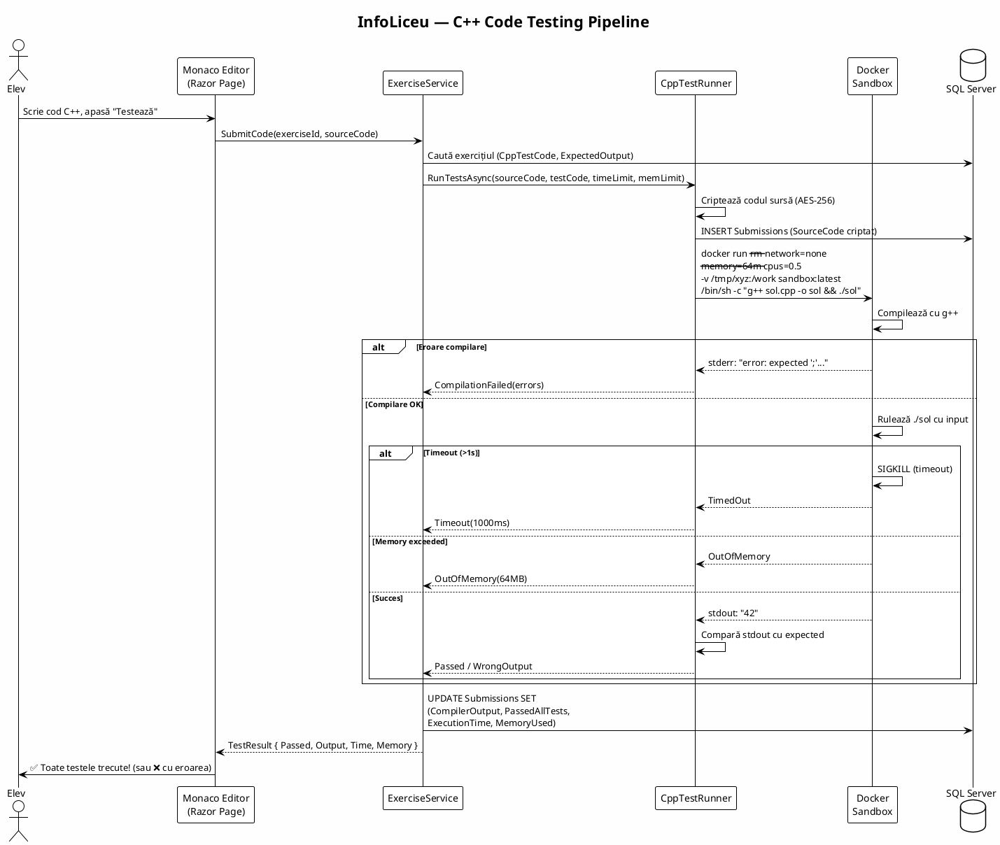

# 09 — Diagrame PlantUML

> **Referință vizuală** — poate fi consultată oricând în timpul implementării.
> Diagramele sunt în format PlantUML. Le poți vizualiza cu extensia PlantUML din VS Code,
> sau pe https://www.plantuml.com/plantuml/uml/

---

## 12.1. Arhitectura Generală a Sistemului

---

## 12.2. Database ERD (Entity-Relationship Diagram)

---

## 12.3. Flow Autentificare (Google OAuth)

---

## 12.4. Flow Mesagerie (SignalR)

---

## 12.5. Flow Plată Stripe (Subscription)

---

## 12.6. Flow Execuție C++ (Docker Sandbox)

---

## 🔗 Documente conexe

- [00-overview.md](./00-overview.md) — Arhitectura generală (text)
- [01-database-schema.md](./01-database-schema.md) — Schema SQL (text)
- [03-messaging.md](./03-messaging.md) — Mesagerie SignalR
- [04-authentication.md](./04-authentication.md) — Google OAuth
- [06-cpp-testing.md](./06-cpp-testing.md) — C++ Docker sandbox
- [10-stripe-integration.md](./10-stripe-integration.md) — Stripe
